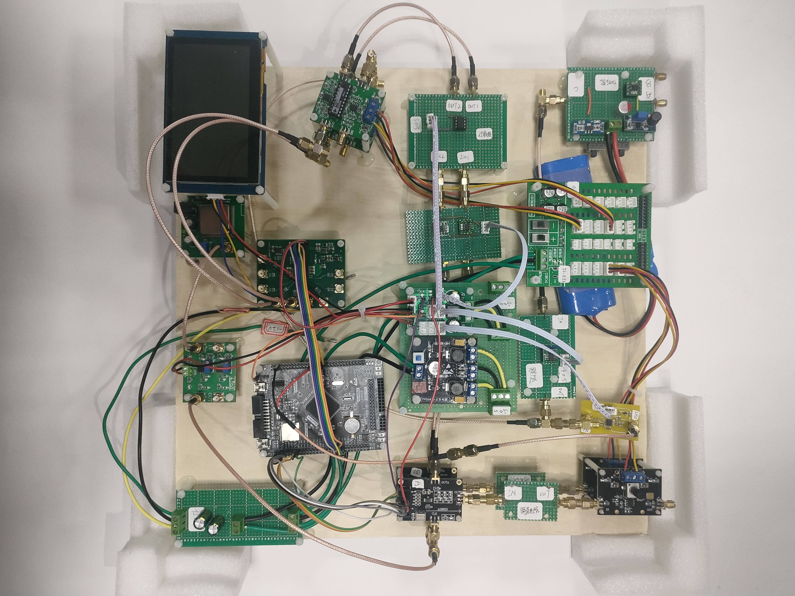

# 信号分离装置 · Signal Separation System

**2023 全国大学生电子设计竞赛 H 题 · 全国一等奖**

**HandDream** · 吴浩瀚、曹志君、刘雨萌 · 山东大学

[嘉立创原项目、代码与视频](https://oshwhub.com/23dian-sai-xiao-sai/23dian-sai-ce-liang-ti) · [项目网页文件](index.html)

本系统以 STM32F407ZGT6 为核心，对混合信号进行 FFT 分析，提取原始信号参数，并通过 AD9833 DDS 重建波形。锁相检测结合软件频率微调构成闭环，实现原始信号与重建信号的稳定同频显示。

## 系统组成

- 输入调理、采样与 FFT 分析。
- 双路 DDS 波形复现及输出幅值调节。
- 锁相检测和闭环频率调节。
- 串口屏显示频谱与信号信息，设置相位差。

## 原项目报告的结果

| 指标 | 结果 |
| --- | --- |
| 混合信号分离范围 | 5–320 kHz |
| 相位差误差 | 小于 2.5° |
| 输出峰峰值 | 1–5 V 可调 |

结果、设计图、测试视频及代码附件以[原项目页面](https://oshwhub.com/23dian-sai-xiao-sai/23dian-sai-ce-liang-ti)为准。这是团队共同完成的项目，本页保留完整团队署名。

## 授权与来源

原项目采用 **CC BY-NC 3.0**。实物图来自上述原项目，未改动图片内容。此仓库用于作品展示与资料索引，未重新打包原站代码；原设计、图片和附件的授权以原发布页为准。

下载本仓库后可直接使用浏览器打开 `index.html` 查看网页。
